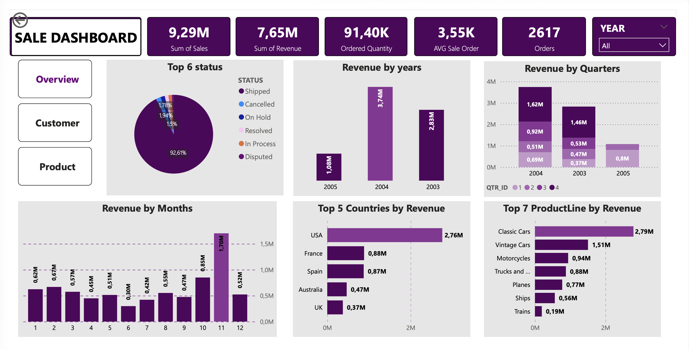

# About Dataset
Sample Sales Data, Order Info, Sales, Customer, Shipping, etc., Used for Segmentation, Customer Analytics, Clustering and More. Inspired for retail analytics. This was originally used for Pentaho DI Kettle, But I found the set could be useful for Sales Simulation training.

Originally Written by María Carina Roldán, Pentaho Community Member, BI consultant (Assert Solutions), Argentina. This work is licensed under the Creative Commons Attribution-Noncommercial-Share Alike 3.0 Unported License. Modified by Gus Segura June 2014.

## Analytics Questions
Before we begin, Let’s first identify and answer some business questions related to our data:
1. Number of revenue over the past several years?
2. Which months have the most revenue?
3. Which country has the most revenue?
4. What types of products do customers order the most?
5. Top 5 best selling products?
6. Which territory has the most revenue?

### Analysis Results

Once I clear my data before. Now I’m ready for analysis. I imported the converted .csv file into Power BI and started creating visualizations to answer the questions in depth.

 

1. In 2003, the total revenue was $2.83. In 2004, the total revenue increased to $3.74, with countries in Europe, the Middle East, and Africa (EMEA) generating the highest revenue, followed by North America (NA) and Asia-Pacific (APAC). Japan accounted for the lowest revenue.

2. Sales rise sharply in November each year, making Quarter 4 the highest revenue quarter in both 2003 and 2004.

3. The number one revenue is United States. When comparing sales of each country, it was found that the majority of the customer base is in the United States, accounting for more than 52% from all countries around the world.

4. Classic cars are number one in revenue. Compared to vintage cars, it may be due to their popularity and demand at that time.

5. The top 5 products are dominated by Classic Cars: №1 S18_3232, №2 S24_3856, №4 S18_2949, №6 S12_1108, and №10 S24_2840. Trucks and Buses hold the next top 3 positions: №3 S50_1392, №5 S12_4473, and №9 S18_2432. Vintage Cars are represented by №7 S18_1342, while Trains are represented by №8 S50_1514.

 
 

 
#### Recommendations for Stakeholders

1.	Sales Trend Analysis: Collect sales data across multiple years to analyze long-term trends. Focus on comparing year-over-year patterns to better understand sales changes and the factors influencing them, such as economic conditions, market dynamics, and marketing activities.

2.	Monthly Sales Analysis: Conduct regular monthly sales analyses to identify fluctuations and trends. This helps explain increases or decreases in sales during specific months and supports planning future activities, such as month-specific promotions or marketing campaigns.

3.	Focus on High-Sales Locations: Concentrate efforts on customers in high-sales regions by tailoring marketing plans and promotional activities to suit each market area. This targeted approach can enhance sales effectiveness.

4.	Product and Service Improvement: Analyze the most frequently ordered products or services to identify customer demand trends. Use this insight to improve or develop offerings that better meet customer needs.

5.	Best-Selling Product Rankings: Monitor and leverage best-selling product rankings to allocate resources effectively. Prioritize the development and marketing of high-potential products to boost awareness and ensure successful market penetration.
